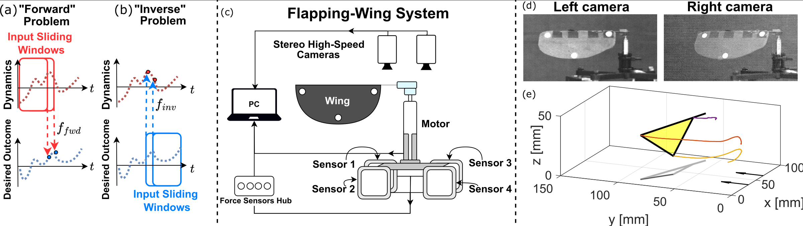
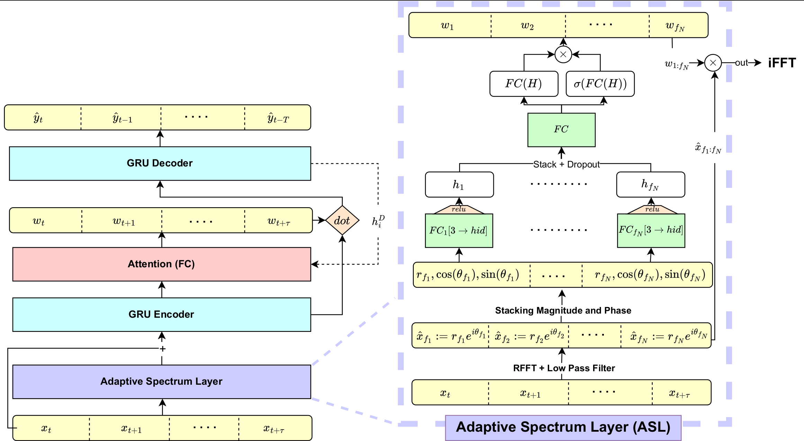

# A Deep Inverse-Mapping Model For A Flapping Robotic Wing (ICLR 2025)
Official PyTorch Implementation for the "A Deep Inverse-Mapping Model for a Flapping Robotic Wing" Paper (ICLR 2025)

<p align="center">
  <a href="https://arxiv.org/abs/2502.09378">
    
  </a>
  <a href="https://drive.google.com/drive/folders/1lfZzpQKdhQHobq_rORQdAVFe87N-QJv3">
    
  </a>
</p>


<div align="center">
<figure>
  
  <figcaption>
    <b>Figure 1:</b> The experimental setup of our custom-built robotic flapping wing system, featuring force sensors and synchronized motion tracking cameras for data collection.
  </figcaption>
</figure>

<figure>
  
  <figcaption>
    <b>Figure 2:</b> Overview of the proposed ASL architecture for Inverse-Mapping
  </figcaption>
</figure>
</div>

## Setup

1. Clone the repository:
  ```bash
  git clone https://github.com/hadar933/AdaptiveSpectrumLayer.git
  cd repo
  ```

2. Create a virtual environment and activate it:
  ```bash
  python3 -m venv venv
  source venv/bin/activate
  ```
  <details>
  <summary>Optional: Configure the Python interpreter in VS Code</summary>

  Configure the Python interpreter in VS Code:
  - Press `Ctrl+Shift+P` to open the command palette.
  - Type `Python: Create Environment` and select `venv`

  </details>

3. Install the dependencies:
  ```bash
  pip install -r requirements.txt
  ```

## Structure

The project is organized into several directories, each with a specific purpose:
- **ML**  
  Implements core machine learning functionality using PyTorch. This includes:  
  - Preprocessed data from our flapping wing system.  
  - A **Zoo** subdirectory with neural network implementations, including the Adaptive Spectrum Layer (ASL) and other architectures.
  - Dataset handling.  
  - Normalization and training utilities (e.g., fit, predict, evaluate).  

- **DataHandler**  
  Contains utilities for:  
  - Data encoding: e.g sin-cos encoding, or calculation of torques from forces.
  - Preprocessing: a basic class that performs resampling, interpolation, etc.
  - Synchronization scrips for matching signals by their start times and consequtive difference value.

- **LTSFLinear**  
  A fork of the primary paper implementation, this directory contains various neural network models, including NLinear, NLinear and FEDformer, for benchmarking.  


- **Utilities**  
  Contains miscellaneous scripts for plotting, data splitting, adding explainability to the analysis, etc.

- **Camera**  
  Handles raw image data and camera calibration. It includes scripts for:  
  - Extracting 3D coordinates.  
  - Tracking trajectories.  
  - MATLAB stereo camera setup calibrations

- **Forces**  
  Processes raw data from force sensors and prepares it for downstream analysis.

> **Note**  
> The `Camera` and `Forces` directories are primarily included for clarity 
> and completeness. These directories were used to generate the already 
> ready-to-use data located in the `ML/Data` directory. Users can directly 
> utilize the data in `ML/Data` without needing to refer to the aformentioned dirs.


## Usage

To run a training job:
```bash
cd ML && python main.py
```

When running `main.py`, TensorBoard logs are saved under `ML/tb_runs`, and saved models are available in `ML/saved_models`.

To start TensorBoard and visualize the logs, use the following command:
```bash
tensorboard --logdir=ML/tb_runs
```

## Datasets

Our implementation supports two types of datasets: our proprietary flapping wing system data and open-source datasets from previous works (references to be added). Each dataset consists of two PyTorch tensors:
- **Kinematics**: Describes wing movements in their respective coordinate systems
- **Forces**: Contains the generated forces when the wing moves according to the specified kinematics

### Proprietary Dataset

Our dataset was collected using a custom-built robotic flapping wing system (shown below). The data includes:
- Kinematics: a list of 153 tensors, with shape `[T_i, 3]`. Namely - each of the 153 experiments has `T_i` time points, with $min_i \{T_i\} = 550$ and $max_i \{T_i\} = 3787$, and three features that represent wing rotation angles pitch, yaw and roll.
- Forces: a list of 153 tensors, with shape `[T_i, 4]`. Same as above, aside from the 4 features that represent 4 force sensors measurements

The data is sampled at a rate of $5000 \texttt{Hz}$.

[Image placeholder - will be added]

### Open Source Datasets

We also provide support for previously published datasets to enable direct comparison with existing work. These include:

The tensor shapes follow the same convention as our proprietary dataset, with
- Kinematics tensor shape `[548, 470, 3]`: 548 experiments, 470 time points, 3 angles of wing rotation (pitch, yaw, roll)
- Forces tensor shape `[548, 470, 5]`: 548 experiments, 470 time points, 3 force measures + 2 torque measures (to a total of 5 features)

The data is sampled at a rate of $25 \texttt{Hz}$.
> **Note**  
> In the open source datasets, all experiments have the same length.

### Download

These datasets are already present in this git repository under the `ML/Data` directory.
You can also access these datasets via this [link](https://drive.google.com/drive/folders/1lfZzpQKdhQHobq_rORQdAVFe87N-QJv3?usp=sharing)


## Citation

If you find this code useful, consider citing our paper with:
```bibtex
@inproceedings{
  sharvit2025a,
  title={A deep inverse-mapping model for a flapping robotic wing},
  author={Hadar Sharvit and Raz Karl and Tsevi Beatus},
  booktitle={The Thirteenth International Conference on Learning Representations},
  year={2025},
  url={https://openreview.net/forum?id=254NJe9JEw}
}
```

## Acknowledgments

Special thanks to the following repositories and resources:
- The paper "State-space aerodynamic model reveals high force control authority and predictability in flapping flight" [(arXiv)](https://arxiv.org/abs/2103.07994) by Yagiz E. Bayiz and Bo Cheng, for providing a strong structure to be compared against and a reliable open source dataset.
- The repository [LTSF-Linear](https://github.com/cure-lab/LTSF-Linear) for their multiple architecture implementations.
- [Beatus Lab](https://www.beatus-lab.org/), for providing the infrastructure and expertise to build such a unique experimental setup.
